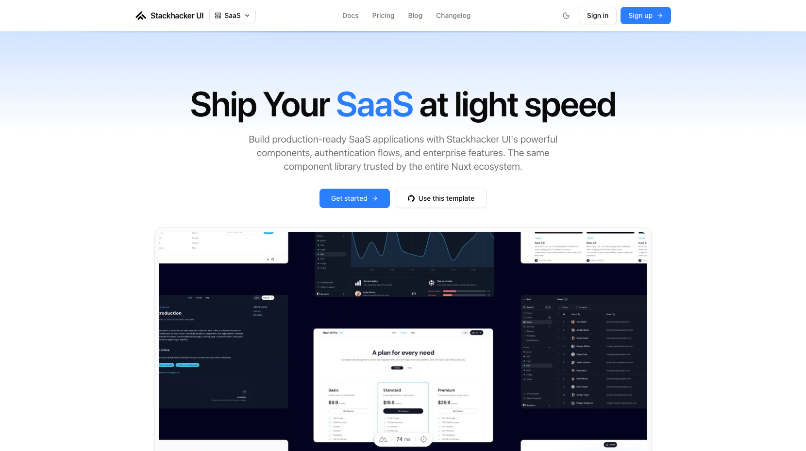

# Stackhacker UI SaaS Template

[](https://ui.stackhacker.io)

A SaaS template for launching a Nuxt app with a landing page, pricing, documentation, blog, changelog, and auth page UI powered by Stackhacker UI, shadcn-vue, and Tailwind CSS v4.

- [Live demo](https://saas-template.stackhacker.io/)
- [Documentation](https://ui.stackhacker.io/docs/getting-started)

<a href="https://saas-template.stackhacker.io/" target="_blank">
  <picture>
    <source media="(prefers-color-scheme: dark)" srcset="public/screenshots/saas-dark.png">
    <source media="(prefers-color-scheme: light)" srcset="public/screenshots/saas-light.png">
    
  </picture>
</a>

## Quick Start

```bash [Terminal]
pnpm dlx nuxi@latest init my-saas -t gh:stackhacker-ui/saas
```

## Deploy your own

[](https://vercel.com/new/clone?repository-name=saas&repository-url=https%3A%2F%2Fgithub.com%2Fstackhacker-ui%2Fsaas&demo-image=https%3A%2F%2Fraw.githubusercontent.com%2Fstackhacker-ui%2Fsaas%2Fmain%2Fpublic%2Fscreenshots%2Fsaas-dark.png&demo-url=https%3A%2F%2Fsaas-template.stackhacker.io%2F&demo-title=Stackhacker%20UI%20SaaS%20Template&demo-description=A%20Nuxt%20SaaS%20template%20with%20landing%2C%20pricing%2C%20docs%2C%20blog%2C%20changelog%2C%20and%20auth%20page%20UI.)

## Setup

Make sure to install the dependencies:

```bash
pnpm install
```

## Development Server

Start the development server on `http://localhost:3000`:

```bash
pnpm dev
```

## Production

Build the application for production:

```bash
pnpm build
```

Locally preview production build:

```bash
pnpm preview
```

Check out the [deployment documentation](https://nuxt.com/docs/getting-started/deployment) for more information.

## Renovate integration

Install [Renovate GitHub app](https://github.com/apps/renovate/installations/select_target) on your repository and you are good to go.
